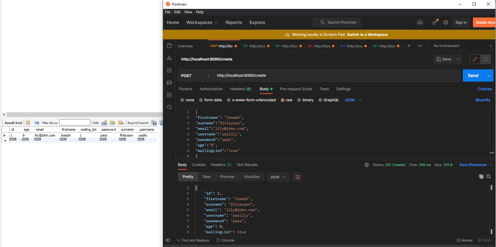
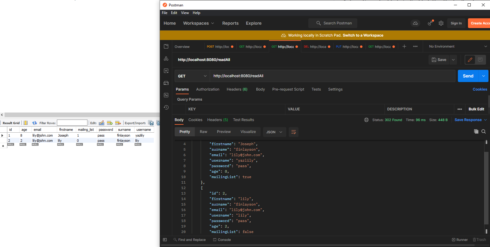
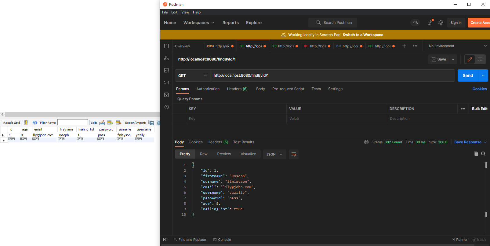
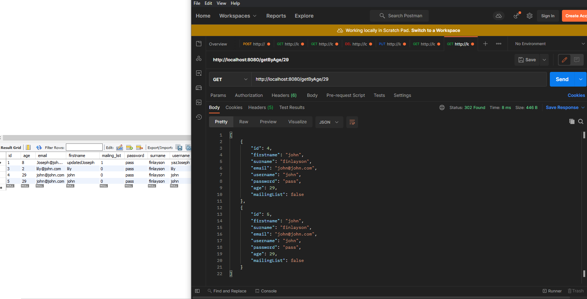
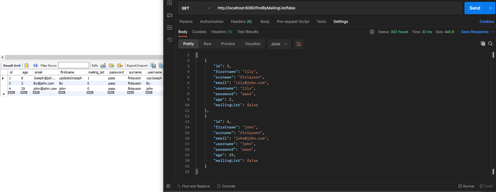
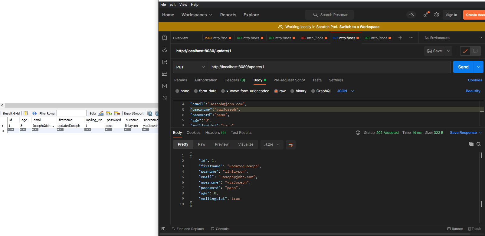
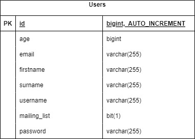

Coverage: 34%
# User-Credential-Final-Project

>User crendential REST API and Database, written with Java on the Spring framework.

## Getting Started


### Prerequisites

The API is running on Java 11

A way of testing API Calls - Postman

A Database to check persistence - MySQL WorkBench/H2 console


```
Give examples
```

### Installing

### Why are we doing this?

I am making this due to it being the final project of a software engineering bootcamp. This is a compilation of learned technologies, methods and fundamentals taught during the bootcamp.


### How I expected the challenge to go.
I excepted the project to go well and went into the project relatively confident.
The only area I was a little apprehensive around was testing processes.

### What went well? / What didn't go as planned?
Developing the API went well and I didn't have much issues with developing CRUD queries, my intial issue came from trying to remember the way in which to upload to git in the correct format and structure. After a while of recapping and research these issues was solved.

I had a few issues during testing, which were in the end sorted and made fully functional, to ensure that the tests were functioning as they should be I implemented sys out statements to ensure that the returned values did match.

Another area in regards to testing I had issues with was testing the exceptions, after researching online I came across a method which used lambda expressions which worked as intended after reading the documentation of different uses.

Adding custom queries and exceptions went well, and worked as they should when tested.

There no issues in regards to connecting to postman or the database and everything went smoothly there!

### Possible improvements for future revisions of the project.
I would like to add password hashing into the project at some point to provide better security, this was set as a stretch goal but unfortunately I didn't have the time to implement this.

I would like to implement in the future would be another table and provided connectivity with that.

I would like to add a frontend but it would've taken me too long to learn that along side doing the project so is definitely something that I will look to do in the future.

### Postman requests and database persistence
Create 

Readall

FindById

GetByAge

MailingList

DeleteById

Update


### Test coverage


### ERD


### Risk Assessment


### Link to Jira Board - You must add your trainer(s) as collaborators also.


